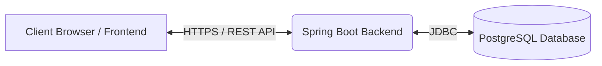

<div align="center">

# 🚀 NexJob - Full-Stack Job Portal

**A modern, responsive, and robust Job Portal connecting top startup talent with fast-growing engineering teams.**

[](https://www.java.com/)
[](https://spring.io/projects/spring-boot)
[](https://reactjs.org/)
[](https://vitejs.dev/)
[](https://tailwindcss.com/)
[](https://www.postgresql.org/)

</div>

---

## 📖 Project Overview

**NexJob** is a comprehensive full-stack job portal designed to streamline the hiring process.
- **Purpose**: To provide a seamless, 1-click application experience for candidates and a powerful job management dashboard for recruiters.
- **Business Value**: Reduces friction in the hiring process, increases applicant conversion rates through a streamlined UX, and provides recruiters with an organized applicant tracking system (ATS).
- **Problem it solves**: Traditional job boards are cluttered and overly complex. NexJob focuses on a clean, modern aesthetic tailored specifically for high-growth tech startups.

---

## 🌐 Live Demo

- **Frontend (Vercel):** https://nex-job-sandy.vercel.app/
- **Backend API (Render):** https://nexjob-qov4.onrender.com
- **Github Repository:** https://github.com/jainjoy-1010/NexJob

---

## ✨ Features

- **🔒 Authentication**: Secure JWT-based registration and login for both Candidates and Recruiters.
- **🏢 Job Posting**: Recruiters can create, edit, activate/deactivate, and delete job postings.
- **🔍 Job Search**: Dynamic job search with filters (Location, Work Mode, Experience, Salary).
- **📝 Apply for Jobs**: Candidates can apply to active jobs with a single click using their primary resume.
- **📊 Recruiter Dashboard**: Analytics and applicant management (Shortlist, Interview, Reject, Hire).
- **🎓 Candidate Dashboard**: Track application statuses, manage saved jobs, and update profile completion.
- **📄 Resume Upload**: Candidates can upload multiple resumes and select a primary one.
- **👤 Profile Management**: Detailed candidate profiles including education, experience, and links.
- **📱 Responsive UI**: Beautifully designed interface that works flawlessly across mobile, tablet, and desktop.

---

## 🛠️ Tech Stack

### Frontend
- **React 18** (TypeScript)
- **Vite** (Build Tool)
- **Tailwind CSS** (Styling)
- **Axios** (API Client)
- **React Router** (Navigation)
- **Lucide React** (Icons)

### Backend
- **Java 21**
- **Spring Boot 3**
- **Spring Security** (JWT Authentication)
- **Spring Data JPA** (Hibernate)
- **Maven** (Dependency Management)
- **Lombok** (Boilerplate reduction)

### Database
- **PostgreSQL** (Production Database)
- **Flyway** (Database Migration)

### Deployment
- **Render** (Backend Hosting)
- **Vercel** (Frontend Hosting)

### CI/CD
- **GitHub Actions** (Automated workflows)
- **Automatic Deployment** (Push-to-deploy pipelines)

---

## 🏗️ System Architecture

The application follows a standard decoupled Client-Server architecture:



1. **Frontend (Vercel)**: React SPA built with Vite. Handles UI rendering, state management, and sends RESTful HTTP requests via Axios.
2. **Backend (Render)**: Spring Boot REST API. Validates requests, enforces role-based access control via Spring Security + JWT, and processes business logic.
3. **Database (Render/External)**: PostgreSQL database managed by Flyway for schema migrations.

---

## 📁 Folder Structure

```text
NexJob/
├── backend/
│   ├── src/main/
│   │   ├── java/com/nexjob/
│   │   │   ├── config/       # Security, CORS, Application configs
│   │   │   ├── controller/   # REST API Endpoints
│   │   │   ├── dto/          # Data Transfer Objects
│   │   │   ├── entity/       # JPA Entities
│   │   │   ├── enums/        # Java Enums (WorkMode, Role, etc.)
│   │   │   ├── exception/    # Custom Global Exception Handlers
│   │   │   ├── repository/   # Spring Data JPA Repositories
│   │   │   ├── security/     # JWT Filters, UserPrincipal
│   │   │   └── service/      # Business Logic
│   │   └── resources/
│   │       ├── db/migration/ # Flyway SQL scripts
│   │       └── application.yml
│   └── pom.xml
│
├── frontend/
│   ├── src/
│   │   ├── components/       # Reusable UI components
│   │   ├── context/          # React Context (AuthContext)
│   │   ├── pages/            # Route Views (Dashboards, Landing)
│   │   ├── services/         # Axios API calls
│   │   ├── types/            # TypeScript Interfaces
│   │   └── utils/            # Helper functions
│   ├── vite.config.ts
│   ├── tailwind.config.js
│   └── package.json
│
└── README.md
```

---

## 🗄️ Database Design

The database schema is managed via Flyway. Key tables include:

- **`users`**: Core table for authentication and identity (Email, Password Hash, Role).
- **`candidate_profiles`**: Linked to users (Candidate), stores headline, skills, and links.
- **`recruiter_profiles`**: Linked to users (Recruiter) and `companies`.
- **`companies`**: Details about hiring companies (Name, Logo, Industry).
- **`jobs`**: Job postings created by recruiters (Title, Salary, Work Mode, Is Active).
- **`applications`**: Junction table tracking candidate applications to jobs (Status, Applied At).
- **`resumes`**: File metadata for uploaded resumes (Path, Size, Is Primary).

*Relationships*:
- One-to-One: `users` ↔ `candidate_profiles` / `recruiter_profiles`
- One-to-Many: `companies` → `jobs`
- Many-to-Many (Resolved): `jobs` ↔ `applications` ↔ `candidate_profiles`

---

## 🔌 API Endpoints

### 🔐 Authentication
- `POST /api/v1/auth/login` - Authenticate user and receive JWT
- `POST /api/v1/auth/register` - Register new Candidate/Recruiter

### 🏢 Jobs (Public & Candidate)
- `GET /api/v1/jobs` - Search and list active jobs
- `GET /api/v1/jobs/{id}` - Get specific job details
- `POST /api/v1/jobs/{id}/save` - Toggle save/bookmark job (Candidate)
- `GET /api/v1/jobs/saved` - Get all saved jobs (Candidate)

### 👔 Jobs (Recruiter)
- `GET /api/v1/recruiter/jobs` - List recruiter's posted jobs
- `POST /api/v1/recruiter/jobs` - Create a new job posting
- `PUT /api/v1/recruiter/jobs/{id}` - Update a job posting
- `PATCH /api/v1/recruiter/jobs/{id}/status` - Toggle job Active/Inactive
- `DELETE /api/v1/recruiter/jobs/{id}` - Delete a job
- `GET /api/v1/recruiter/jobs/{jobId}/applicants` - Get applicants for a job

### 📝 Applications
- `POST /api/v1/applications/jobs/{jobId}` - Apply to a job (Candidate)
- `GET /api/v1/applications/my-applications` - Get candidate's applications
- `PATCH /api/v1/recruiter/applications/{appId}/status` - Update application status (Recruiter)

### 📄 Resumes
- `POST /api/v1/resumes` - Upload a resume
- `GET /api/v1/resumes` - Get user's resumes
- `PATCH /api/v1/resumes/{id}/primary` - Set resume as primary
- `DELETE /api/v1/resumes/{id}` - Delete a resume

---

## 🔑 Authentication Flow

NexJob utilizes a stateless JWT (JSON Web Token) authentication flow:

1. **Client Request**: User submits email/password to `/api/v1/auth/login`.
2. **Server Validation**: Spring Security's `AuthenticationManager` verifies credentials against the database hash.
3. **Token Generation**: If valid, the server generates a JWT signed with a secret key and returns it.
4. **Client Storage**: The frontend stores the token in `localStorage`.
5. **Authenticated Requests**: Axios Interceptors automatically attach `Authorization: Bearer <token>` to all subsequent protected API requests.
6. **Server Verification**: `JwtAuthenticationFilter` validates the token signature and extracts the `UserPrincipal`, granting access based on roles (`CANDIDATE` or `RECRUITER`).

---

## 🖼️ Screenshots

*(Placeholders for future screenshots)*

| Landing Page | Login & Registration |
| --- | --- |
|  |  |

| Candidate Dashboard | Recruiter Dashboard |
| --- | --- |
|  |  |

| Job Listing / Search | Application Page |
| --- | --- |
|  |  |

---

## 💻 Local Setup

### Prerequisites
- Node.js (v18+)
- Java 21 JDK
- Maven
- PostgreSQL (v14+)

### 1. Clone Repository
```bash
git clone https://github.com/jainjoy-1010/NexJob.git
cd NexJob
```

### 2. Database Setup
Create a PostgreSQL database locally:
```sql
CREATE DATABASE nexjob_db;
```

### 3. Backend Setup
Navigate to the backend directory and configure the environment:
```bash
cd backend
```
Configure the required environment variables (see the Environment Variables section below) before starting the application.

Run the Spring Boot application:
```bash
./mvnw spring-boot:run -Dspring-boot.run.profiles=dev
```
*Backend runs on `http://localhost:8080`*

### 4. Frontend Setup
Navigate to the frontend directory:
```bash
cd ../frontend
npm install
```
Start the Vite development server:
```bash
npm run dev
```
*Frontend runs on `http://localhost:5173`*

---

## 🌍 Environment Variables

Create a `.env` file in both `backend` and `frontend` directories based on these templates:

### Backend (`backend/src/main/resources/application.yml` or ENV vars)
```env
DATABASE_URL=jdbc:postgresql://localhost:5432/nexjob_db
DB_USERNAME=postgres
DB_PASSWORD=your_password
JWT_SECRET=your_super_secret_jwt_key_that_is_long_enough
FRONTEND_URL=http://localhost:5173
```

### Frontend (`frontend/.env` and `frontend/.env.production`)
```env
# Local Development (.env)
VITE_API_BASE_URL=http://localhost:8080/api/v1

# Production (.env.production)
VITE_API_BASE_URL=https://nexjob-qov4.onrender.com/api/v1
```

---

## 🚀 Deployment Guide

### Backend (Render)

1. Connect the GitHub repository to **Render** as a **Web Service**.
2. Configure the service to use the project's **Dockerfile**.
3. Render automatically builds the Docker image on every push to the `main` branch.
4. The Docker container starts the Spring Boot application automatically.
5. Configure the required environment variables in the Render dashboard:
    - `DATABASE_URL`
    - `DB_USERNAME`
    - `DB_PASSWORD`
    - `JWT_SECRET`
    - `FRONTEND_URL`
6. After deployment, the backend will be available at the Render service URL.

### PostgreSQL Database
1. Provision a managed PostgreSQL instance (e.g., via Render, Supabase, or Neon).
2. Grab the connection string and update the Render backend `DATABASE_URL`.
3. Flyway will automatically run the schema migrations on application startup.

### Frontend (Vercel)
1. Connect your GitHub repository to Vercel.
2. Set Root Directory to `frontend`.
3. Framework Preset: `Vite`.
4. Build Command: `npm run build`.
5. Add the Frontend Environment Variable: `VITE_API_BASE_URL`.

---

## ⚙️ CI/CD Pipeline

The project utilizes **GitHub Actions** for Continuous Integration and Continuous Deployment.

- **Automated Workflows**: Configured via `.github/workflows/`.
- **Build & Test**: On every push or pull request to the `main` branch, GitHub actions spins up a runner to compile the Java backend and build the React frontend.
- **Deployment Validation**: Ensures the codebase is stable and compile-able before triggering webhooks.
- **Automatic Deployment**: GitHub Actions validates that the frontend and backend build successfully. After code is pushed to the main branch, Vercel and Render automatically deploy the latest version from GitHub.

---

## 🔮 Future Improvements

- [ ] **Notifications**: Real-time WebSocket notifications for application status updates.
- [ ] **Email Verification**: JavaMail integration for account confirmation.
- [ ] **Forgot Password**: Password reset flow with secure expiring tokens.
- [ ] **Interview Scheduling**: Calendly integration for recruiters.
- [ ] **Admin Panel**: Super-admin dashboard to monitor platform health and users.
- [ ] **Chat**: In-app messaging between recruiter and candidate.
- [ ] **AI Resume Analysis**: Integrate Gemini/OpenAI to auto-score resumes against job descriptions.

---

## ⚠️ Known Limitations

- Currently lacks email notification workflows.
- No platform-wide analytics for administrators.
- Search filters are basic (keyword, location, work mode); lacks advanced fuzzy searching.
- No implementation of caching (e.g., Redis) for high-traffic endpoints.

---


<div align="center">
  <b>Built with ❤️ by Jain Joy.</b>
</div>
